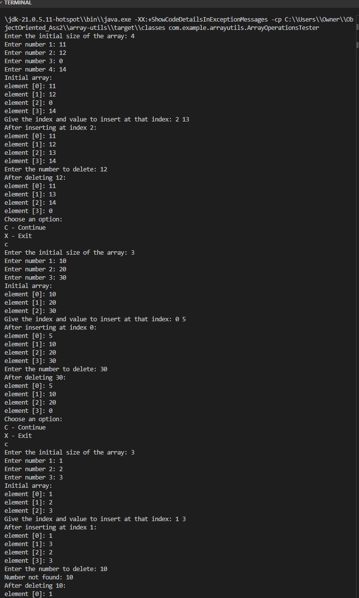

# Array Utils Project

This project provides utility functions for managing dynamic arrays in Java. It includes classes for performing various operations on arrays, such as inserting and removing elements, and a tester class to demonstrate the functionality.

## Project Structure

<pre>
c:/Users/Owner/ObjectOriented_Ass2/array-utils
├── pom.xml
│
├── src
│   └── main
│       └── java
│           └── com
│               └── example
│                   └── arrayutils
│                       ├── ArrayOperations.java
│                       ├── DynamicArrayManager.java
│                       └── ArrayOperationsTester.java
│
├── Pictureshot.png
└── README.md
</pre>
## Classes
### src/main/java/com/example/arrayutils

This directory contains the main Java classes for the project.

## Usage

1. **ArrayOperations.java**: This file contains reusable static methods for array operations.
   - URL: [View ArrayOperations.java](src/main/java/com/example/arrayutils/ArrayOperations.java)

2. **DynamicArrayManager.java**: This file contains methods to manage a dynamic array, including prompting the user for input and displaying the array contents.
   - URL: [View DynamicArrayManager.java](src/main/java/com/example/arrayutils/DynamicArrayManager.java)

3. **ArrayOperationsTester.java**: This file contains the main method to test the dynamic array manager. It demonstrates the functionality by prompting the user for input and performing array operations.
   - URL: [View ArrayOperationsTester.java](src/main/java/com/example/arrayutils/ArrayOperationsTester.java)

## Screenshot

